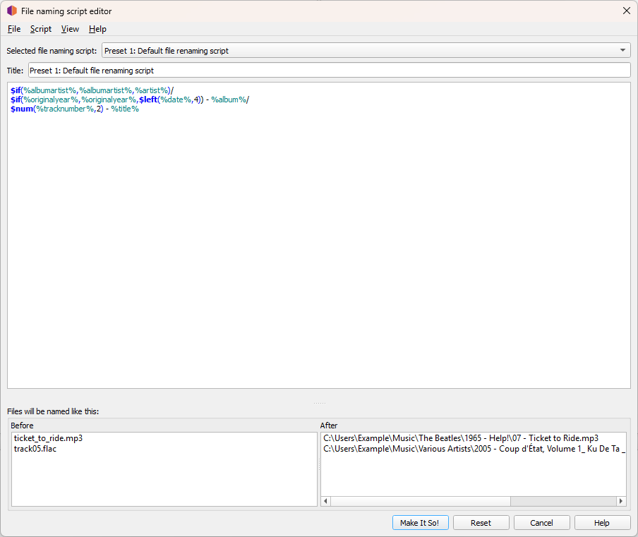
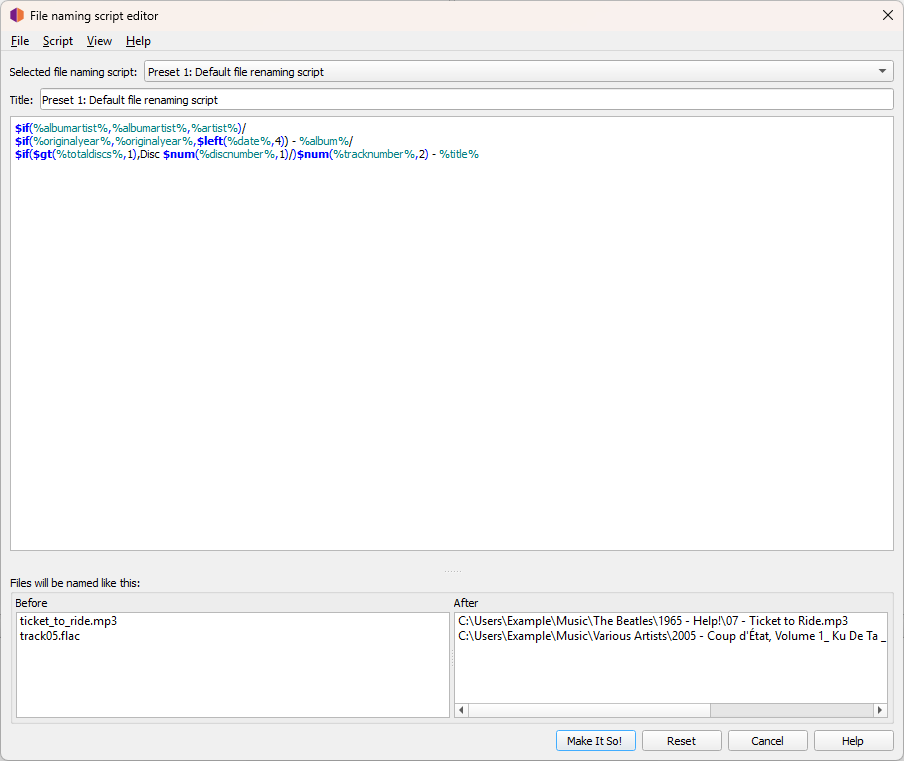
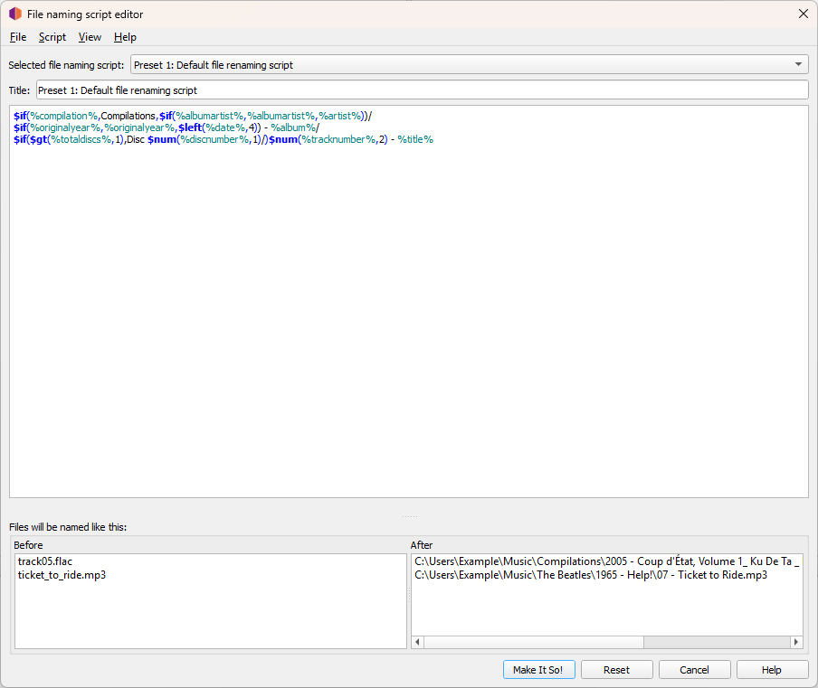
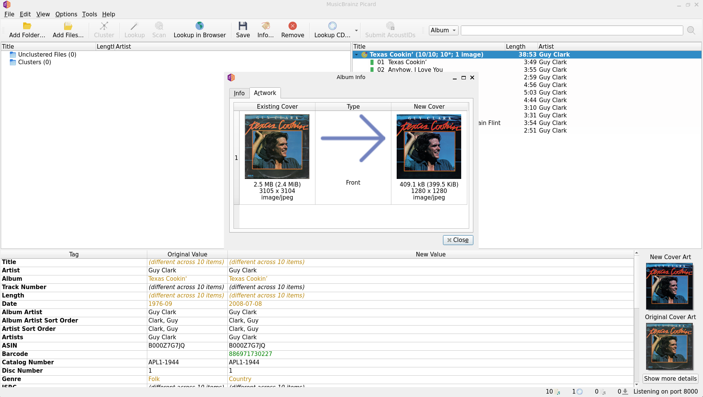
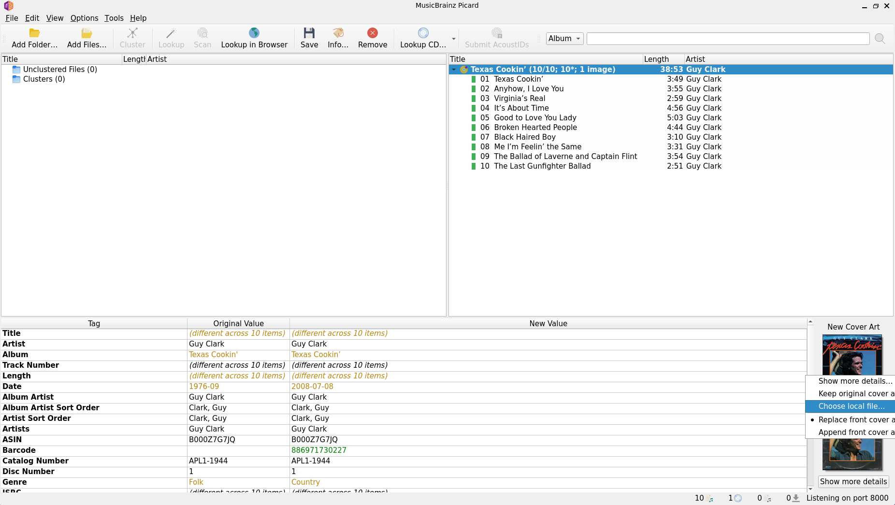
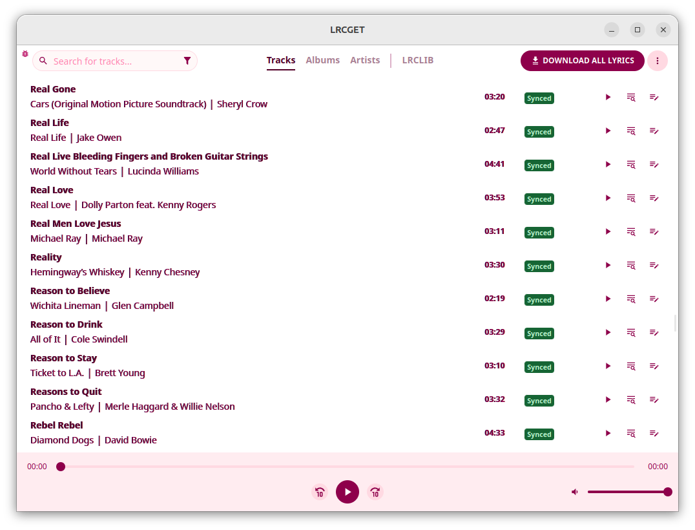
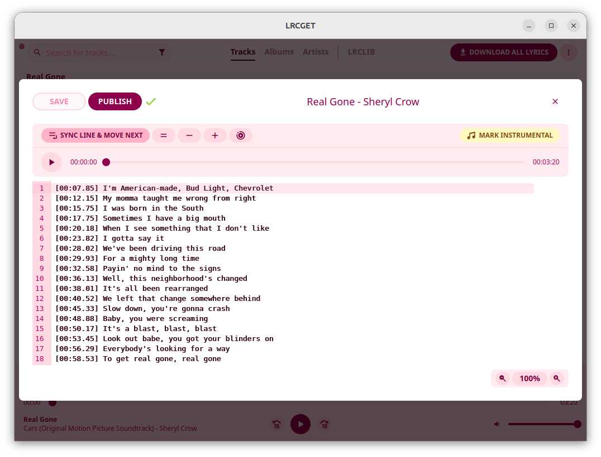

# The Practical Guide to Managing a Music Library


A practical guide to building, organizing, tagging, backing up, and preserving a personal music library.

## Contents

- [Introduction](#introduction)
- [Chapter 1 – The Philosophy: Metadata First](#chapter-1--the-philosophy-metadata-first)
- [Chapter 2 – Configuring MusicBrainz Picard](#chapter-2--configuring-musicbrainz-picard)
- [Chapter 3 – Common Mistakes That Break a Music Library](#chapter-3--common-mistakes-that-break-a-music-library)
- [Chapter 4 – ReplayGain](#chapter-4--replaygain)

# Introduction

Music libraries have never been easier to build and never harder to maintain.

Storage is cheap, music is available in countless formats, and modern software can stream a collection to virtually any device. Yet many people still struggle with the same problems: duplicate albums, inconsistent metadata, broken artwork, missing lyrics, albums split into multiple entries, and libraries that become increasingly difficult to manage as they grow.

This guide focuses on solving those problems.

It is intended for anyone who owns a collection of digital music files and wants to organize them in a clean, consistent, and maintainable way. Whether your collection contains a few hundred tracks or tens of thousands, the principles remain the same.

This guide does **not** explain how to obtain music. It assumes that you already have audio files and want to build a well-structured library from them. The source of those files is outside the scope of this document.

The goal is simple: transform a folder full of audio files into a collection that is properly tagged, easy to navigate, compatible with modern music servers and players, and resilient enough to remain organized for years.

The workflow described here is based on widely adopted tools and standards, with a particular focus on [MusicBrainz Picard](https://picard.musicbrainz.org/), ReplayGain, [Navidrome](https://www.navidrome.org/), and self-hosted music management. However, most of the concepts apply equally well regardless of the software you choose.

> [!NOTE]
> This guide is actively maintained. Chapters on artwork management, lyrics, backup strategies, and archival practices are in preparation and will be added in subsequent revisions.

Before discussing software, folder structures, or streaming servers, it is important to understand a fundamental concept:

a music library is not built on folders.

A music library is built on metadata.

# Chapter 1 – The Philosophy: Metadata First

One of the most common mistakes made when building a music collection is focusing on folder names before focusing on metadata.

Many users spend hours manually renaming directories, moving files between folders, and maintaining increasingly complex folder structures. While a clean directory layout is useful, it is not what defines a music library.

Modern music players and music servers do not primarily read folder names. They read metadata.

Artist names, album titles, release dates, track numbers, disc numbers, album artists, genres, artwork, ReplayGain information, and lyrics are all stored inside the files themselves. These tags are what allow software to understand and organize your collection correctly.

A properly tagged library can survive being moved to a different drive, copied to another computer, imported into a new application, or served through a music server with minimal effort.

A poorly tagged library, on the other hand, remains problematic regardless of how carefully the folders are organized.

For this reason, metadata should always be considered the single source of truth.

A clean music library rests on four fundamental pillars:

* accurate metadata
* consistent artwork
* proper ReplayGain information
* predictable file and folder naming

Folders are important, but they should be generated from metadata rather than maintained manually. Once metadata is accurate and consistent, tools such as MusicBrainz Picard can automatically create a logical and predictable directory structure.

This approach has several advantages:

* fewer duplicates
* more reliable album grouping
* better compatibility across applications
* easier migration between platforms
* less manual maintenance over time

When users encounter problems such as albums appearing multiple times in Navidrome, tracks disappearing from a release, or compilations being split incorrectly, the cause is almost always inconsistent metadata rather than an incorrect folder structure.

For that reason, every step described in the following chapters begins with the same principle:

fix the metadata first.

# Chapter 2 – Configuring MusicBrainz Picard

Once the principles described in the previous chapter are understood, it is time to configure the tool that will become the foundation of the entire workflow: MusicBrainz Picard.

Picard is a free and open-source music tagger built around the MusicBrainz database. It is available for Windows, macOS, and Linux, and installation is straightforward regardless of platform.

Download and installation instructions can be found on the official website:

https://picard.musicbrainz.org/

For the purposes of this guide, the default installation is sufficient. No special installation options are required.

Before tagging any music, however, it is worth spending a few minutes configuring Picard properly. A good initial configuration will save countless hours later and help maintain a consistent library over time.

## Genre Settings

Genres are one of the most debated topics in music library management.

Some users prefer highly specific classifications with multiple genres assigned to every release. Others prefer a simpler approach focused on broad categories such as Rock, Country, Pop, Jazz, Blues, or Classical.

This guide follows the second approach.

The goal is not to build an exhaustive music taxonomy, but to maintain genres that remain useful when browsing a collection.

Under:

Metadata → Genres

configure the following options:

* enable **Use genres from MusicBrainz**
* enable **Fall back to album artist's genres**
* disable **Use folksonomy tags as genre**
* set **Minimal genre usage** to 90%
* set **Maximum number of genres** to 1
* leave **Join multiple genres with** empty

With these settings, Picard will only assign genres that have broad consensus within the MusicBrainz database and will limit each release to a single primary genre.


This produces cleaner and more predictable results than allowing multiple overlapping genres or community-created folksonomy tags.

The exact values are ultimately a matter of personal preference, but maintaining consistency across the entire collection is more important than choosing any particular genre strategy.

One limitation of this configuration is worth noting. Setting the minimum genre usage threshold to 90% means that Picard will only assign a genre if that genre has very strong consensus in the MusicBrainz database for that specific release. For well-documented releases this works well, but for less common recordings (live albums, regional releases, obscure artists) the threshold may be too high, and some albums may end up with no genre at all.

If you notice that a significant portion of your library remains untagged after processing, lowering the threshold to 70% or 80% will produce more genre assignments while still filtering out low-confidence tags. Alternatively, genres can always be assigned manually in Picard for individual releases.

## Cover Art Settings

Album artwork plays an important role in modern music libraries.

Most music players and servers display artwork directly in the interface, and many users expect artwork to remain available regardless of which application is used.

For maximum compatibility, this guide recommends storing artwork both inside the audio files and as a separate image file.

Under:

Cover Art

configure the following options:

* enable **Embed cover images into tags**
* enable **Embed only a single front image**
* enable **Save cover images as separate files**
* set image filename to **cover**
* enable **Overwrite the file if it already exists**
* enable **Save only a single front image as separate file**
* disable **Always use the primary image type as the file name**

For cover art providers:

* leave **Cover Art Archive (Release)** enabled
* leave **Allowed Cover Art URLs** enabled
* leave **Cover Art Archive (Release Group)** enabled
* enable **Local Files**


Then open:

Cover Art → Cover Art Archive

and set:

Only use images of the following size: Full size


With these settings, Picard embeds a single front cover image directly into each audio file and saves an identical image as a separate `cover.jpg` file in the album directory.

Storing artwork in both locations maximises compatibility. Embedded artwork is used by players that read directly from the audio file, regardless of the folder structure. The separate `cover.jpg` file is used by music servers such as Navidrome, by some media players that prefer external artwork, and as a fallback if the embedded image is ever stripped or corrupted.

Enabling **Save only a single front image as separate file** ensures that only one image file is written to each album folder. If this option is left disabled, Picard may save additional image types (back cover, booklet pages, disc scans) as separate files alongside `cover.jpg`. While this can be useful in certain archival contexts, it introduces complications: many players and servers pick up the first image file found alphabetically, which may not be the front cover. Keeping a single `cover.jpg` per directory avoids this ambiguity entirely.

## File Naming and Library Structure

One of Picard's greatest strengths is its ability to automatically organize a music collection.

Instead of manually creating folders and renaming files, metadata can be used to generate a consistent structure automatically.

The structure used throughout this guide is:

```text
Artist/
└── Year - Album/
    ├── 01 - Track.flac
    ├── 02 - Track.flac
    └── cover.jpg
```

This layout is simple, readable, and compatible with virtually every music player and self-hosted music server.

To configure it, open:

File Naming

and enable:

* **Move files when saving**
* **Delete empty directories**
* **Rename files when saving**

Then choose the destination directory that will contain your music library.

> [!WARNING]
> When **Move files when saving** is enabled, Picard moves files into the destination library. Files will no longer remain in their original location after saving. For this reason, many users maintain a separate **incoming** directory for newly acquired music and use Picard to move completed releases into the main library.


Select:

Edit file naming script...

and use the following naming script:

```text
$if(%albumartist%,%albumartist%,%artist%)/$if(%originalyear%,%originalyear%,$left(%date%,4)) - %album%/$num(%tracknumber%,2) - %title%
```



This script contains three layers of logic, each handling a potential
inconsistency in the source metadata.

| Component | Logic |
|---|---|
| **Root folder** | Uses `%albumartist%` rather than `%artist%`, so albums with guest artists or collaborations always group under a single consistent directory. Falls back to `%artist%` if `%albumartist%` is not populated. |
| **Album folder** | Prefixed with `%originalyear%`, which records when a work was first published rather than when a specific edition was released. Falls back to the first four characters of `%date%`, which is populated far more consistently in MusicBrainz. Without this fallback, albums missing both fields would generate folder names beginning with a bare dash. |
| **Track filename** | `$num(%tracknumber%,2)` pads the track number to two digits, ensuring correct sort order in any file manager or application that uses alphabetical ordering. |

Before saving an album, confirm in Picard that at least one date field is present. If both `%originalyear%` and `%date%` are empty, the album folder will be named ` - Album Title`, which is visually awkward and may cause sorting issues. In that case, enter the date manually before saving.

Users interested in advanced naming rules can consult the official Picard scripting documentation:

https://picard-docs.musicbrainz.org/en/latest/config/options_filerenaming_editor.html

## Multi-Disc Releases

The script above works correctly for standard single-disc albums. For multi-disc releases, additional logic is needed to avoid file name collisions.

Without disc handling, a double album would place all tracks in a single folder. Because track numbers restart from one on each disc, this produces duplicate file names: two files named `01 - Track.flac`, two named `02 - Track.flac`, and so on. Depending on the operating system, one file may silently overwrite the other.
To handle multi-disc releases correctly, use the following script instead:

```text
$if(%albumartist%,%albumartist%,%artist%)/$if(%originalyear%,%originalyear%,$left(%date%,4)) - %album%/$if($gt(%totaldiscs%,1),Disc $num(%discnumber%,1)/)$num(%tracknumber%,2) - %title%
```



The `$if($gt(%totaldiscs%,1),...)` condition checks whether the release contains more than one disc. If it does, a `Disc N` subfolder is inserted automatically. If it does not, the folder structure remains identical to the single-disc version.

The result for a double album looks like this:

```text
Artist/
└── 1972 - Album Title/
    ├── Disc 1/
    │   ├── 01 - Track.flac
    │   └── 02 - Track.flac
    └── Disc 2/
        ├── 01 - Track.flac
        └── 02 - Track.flac
```

This approach is recommended if your library contains any multi-disc releases. For a collection consisting entirely of single-disc albums, the simpler script is sufficient.

## Compilations and Various Artists Releases

With the naming scripts described above, compilations and various-artists releases will be grouped under a `Various Artists` folder, since Picard writes `Various Artists` as the Album Artist for those releases by default.

```text
Various Artists/
└── 1994 - Pulp Fiction (Music From the Motion Picture)/
    ├── 01 - Track.flac
    └── 02 - Track.flac
```

This behaviour is predictable and works well in most cases. All compilations end up in one place, easy to browse as a group.

If you prefer to keep compilations entirely separate from artist folders (for example, in a dedicated `Compilations` directory at the root of the library) this can be achieved by modifying the script with a conditional check on the compilation flag:

```text
$if(%compilation%,Compilations,$if(%albumartist%,%albumartist%,%artist%))/$if(%originalyear%,%originalyear%,$left(%date%,4)) - %album%/$if($gt(%totaldiscs%,1),Disc $num(%discnumber%,1)/)$num(%tracknumber%,2) - %title%
```



The `$if(%compilation%,...)` condition checks whether the compilation flag is set. If it is, the file goes into a `Compilations` folder instead of the artist folder.

Both approaches are valid. The important thing is to choose one and apply it consistently across the entire library.

## Installing the ReplayGain Plugin

ReplayGain deserves its own chapter because it has a significant impact on listening experience.

For now, the goal here is simply to configure Picard so that ReplayGain can be calculated as part of the normal tagging workflow.

Open:

Plugins

Locate:

ReplayGain 2.0

and install it.

Once enabled, a new configuration section called:

ReplayGain 2.0

will appear in the settings menu.


Before continuing, install the external utility rsgain.

Installation instructions are available at:

https://github.com/complexlogic/rsgain

After installation, configure ReplayGain as follows:

* **Path to rsgain**: `rsgain`
* enable **Calculate album gain/peak**
* enable **Use true peak**
* disable **Write reference loudness tags** (optional: see the ReplayGain chapter for a discussion of this choice)
* set **Target Loudness** to -18 LUFS
* set **Clipping Protection** to "Enabled for positive gain values only"
* set **Max Peak** to -1 dB
* set **Opus Files** to "Write standard ReplayGain tags"
* leave **Always reference Opus R128_*_GAIN tags to -23 LUFS** disabled


These values provide a practical balance between consistency and listening comfort.

ReplayGain standards, loudness targets, clipping protection, and alternative configurations are discussed in detail in Chapter 4.

> [!NOTE]
> Picard supports a large collection of optional plugins that extend its functionality. A complete list is available at: https://picard.musicbrainz.org/plugins/
> Most users can begin with the default installation and the ReplayGain plugin alone. Additional plugins can be added later as specific needs arise.

# Chapter 3 – Common Mistakes That Break a Music Library

A well-organized music library can remain reliable for years.

A poorly organized one becomes increasingly difficult to maintain as it grows.

Most library problems are not caused by software bugs. They are usually the result of inconsistent metadata, incomplete tagging, or small mistakes that accumulate over time.

This chapter covers some of the most common issues encountered when managing a music collection and explains how to avoid them.

## Mixing Different Releases of the Same Album

One of the most common causes of duplicate albums in Navidrome, Jellyfin, and other music servers is mixing tracks from different releases of the same album.

To understand why this happens, it is important to understand how MusicBrainz works.

When Picard identifies an album, it does not simply associate your files with an album title. It associates them with a specific release recorded in the MusicBrainz database.

A single album can have dozens of different releases.

For example:

* original CD release
* digital release
* vinyl release
* SACD release
* anniversary edition
* deluxe edition
* releases intended for different countries or markets

Each of these releases has its own entry in MusicBrainz and may contain slightly different metadata.

For this reason, selecting the correct release is an important step during the tagging process.

One useful way to verify a match is to compare track durations. If the lengths shown by MusicBrainz closely match the lengths of your files, there is a good chance you have selected the correct release.

This is only a guideline, not an absolute rule. Sometimes MusicBrainz may only contain a release that differs from the files you own. In those situations, you can manually adjust the metadata and, if appropriate, contribute a new release to the MusicBrainz database.

It is important to remember that selecting a release does not alter the audio itself.

If MusicBrainz indicates a track length of 2:58 while your file is 3:00 long, Picard will not modify or trim the audio. The duration is simply metadata used for identification and matching.

### How Duplicate Albums Appear

A common scenario looks like this:

1. a few tracks from an album are added to the library
2. Picard associates them with Release A
3. weeks or months later, additional tracks from the same album are added
4. Picard associates them with Release B
5. the files are saved


At first glance everything appears correct.

The folder structure may look perfectly organized.

All tracks may even be located inside the same album directory.


However, the metadata now references two different MusicBrainz releases.

As a result, Navidrome, Jellyfin, and similar applications may display what appears to be two separate copies of the same album.


### How to Fix It

The easiest solution is to ensure that all tracks belonging to an album are tagged against the same release.

If an album already exists in your library:

1. load the existing album into Picard
2. Picard will place it directly in the right-hand pane because it is already tagged
3. drag the new tracks onto that existing release
4. save the files again

This ensures that all tracks share the same release metadata.

After adding or replacing tracks, remember to recalculate ReplayGain for the entire album before saving.

> [!TIP]
> In Navidrome, a manual rescan can be triggered from **Administration → Scan Library**. This is useful after fixing metadata to see the corrected results immediately without waiting for the next scheduled scan.

## Consistency Matters More Than Perfection

Many users spend a great deal of time searching for the "perfect" metadata.

In practice, consistency is often more important than perfection.

Small differences that seem harmless to a human reader can create confusion for music players and music servers.

A library should follow the same conventions everywhere.

Choose a method and apply it consistently.

### Artist Names

Artist names should always be written the same way throughout the collection.

For example, an artist might appear in one release as:

```text
Reba McEntire
```

and in another as:

```text
Reba
```

Both may be technically correct depending on the release metadata, but mixing naming styles can make browsing less predictable and may fragment artist pages in some applications.

If you decide to standardize artist names, apply the same rule consistently across the entire library.

### Featuring Artists

Featuring credits are another common source of inconsistency.

Different releases may use:

```text
feat.
featuring
with
&
and
```

MusicBrainz generally handles these situations well, but differences still appear from time to time.

Which style you choose matters less than applying it consistently throughout the collection.

## Essential Metadata Fields

Not every metadata field is equally important.

Some tags are optional and largely cosmetic.

Others are fundamental for proper library organization.

If you only verify a handful of fields when reviewing an album, verify these.

### Title

The song title.

Every track should have a clear and accurate title.

### Artist

The performer of the track.

This field identifies who performs the song and is one of the primary fields used when browsing a collection.

### Album

The album to which the track belongs.

Every track belonging to the same album should use exactly the same album name.

Even small differences can cause albums to split unexpectedly.

### Album Artist

This is one of the most important fields in a music library.

For standard albums, Album Artist is usually the primary artist.

For compilations, soundtracks, and various-artists collections, Album Artist should typically be set to:

```text
Various Artists
```

All tracks belonging to the same release should share the same Album Artist value.

Incorrect or missing Album Artist tags are one of the most common causes of album fragmentation.

### Track Number

Tracks should always have track numbers.

Without them, music servers may sort songs alphabetically instead of in album order.

### Disc Number

For multi-disc releases, Disc Number is essential.

Without it, tracks from different discs may become mixed together or appear in the wrong order.

### Date Information

Dates are often overlooked but provide valuable context.

This guide recommends preserving:

* Original release year
* Release year
* Full release date when available

These fields become particularly useful when working with reissues, remasters, anniversary editions, and deluxe releases.

### Genre

Genres are optional compared to the fields above, but they remain useful for browsing and filtering a large collection.

Consistency is more important than complexity.

### Compilation Flag

Compilation albums deserve special attention.

If an album contains tracks by multiple artists, the compilation flag and Album Artist metadata help ensure that the release is displayed as a single album rather than being fragmented into separate artist entries.

### MusicBrainz Identifiers

When Picard tags an album, it writes a set of MusicBrainz identifiers into the file tags alongside the standard metadata fields. These include tags such as `MUSICBRAINZ_ALBUMID`, `MUSICBRAINZ_ARTISTID`, and `MUSICBRAINZ_TRACKID`.

These identifiers are invisible during normal playback but serve an important practical function.

When you load an already-tagged file back into Picard (for example, to add a missing track to an album already in the library, or to recalculate ReplayGain) Picard reads the MusicBrainz Album ID and immediately recognises which release the file belongs to. The file appears directly in the right-hand pane, already matched to the correct release, without requiring a new search or manual identification.

Without these identifiers, Picard would need to perform acoustic fingerprinting or text matching to identify the release again, which is slower and occasionally produces incorrect matches.

For this reason, it is worth treating MusicBrainz identifiers as part of the essential metadata of a well-maintained library. They are written automatically by Picard and require no manual intervention, but they should not be stripped by any tag-cleaning operation.

## Trust the Metadata, Not the Folder Structure

One of the recurring themes throughout this guide is that folders can be misleading.

An album can appear perfectly organized on disk while still containing metadata inconsistencies that confuse every application reading it.

When troubleshooting a music library, always inspect the metadata first.

If something appears broken in Navidrome, Jellyfin, Foobar2000, MusicBee, or another player, the cause is far more likely to be found in the tags than in the directory structure.

Metadata remains the single source of truth.

# Chapter 4 – ReplayGain

One of the most valuable additions you can make to a music library is ReplayGain.

Many users discover it only after experiencing a common problem: some albums play much louder than others.

A modern pop release may sound extremely loud, while an older jazz recording or a classical album may require a significant volume increase. Constantly adjusting the volume between tracks, albums, or artists quickly becomes frustrating.

ReplayGain was created to solve this problem.

## What ReplayGain Is

ReplayGain is a loudness normalization system based on metadata.

It analyzes the perceived loudness of your music and writes information into the file tags that compatible players can use during playback.

The important detail is that ReplayGain does **not** modify the audio itself.

The music remains untouched.

ReplayGain simply tells the player:

> "When playing this track or album, increase or decrease the volume by this amount."

The decision is made during playback, not during scanning.

This makes ReplayGain completely reversible and safe to use.

If you remove the ReplayGain tags, the audio files return to behaving exactly as they did before.

## What ReplayGain Does Not Do

ReplayGain is often misunderstood.

It does not re-encode audio, modify waveforms, or permanently alter volume levels. It stores playback instructions, nothing more.

Because of this, it can safely be applied multiple times without any effect on audio quality, and the tags can be removed at any time to restore the original behaviour.

## ReplayGain vs Destructive Normalization

Many audio editors offer some form of "normalization".

Traditional normalization permanently modifies the audio data itself.

For example, a file might be rewritten so that its loudest sample reaches a chosen target level.

ReplayGain works differently.

Instead of changing the audio, it stores metadata describing how much adjustment should occur during playback.

This distinction is extremely important.

With destructive normalization:

* the audio is modified
* reverting the operation may not be possible
* repeated processing can reduce quality in lossy formats such as MP3 and AAC, where each re-encoding introduces additional artifacts

With ReplayGain:

* the audio remains untouched
* the operation is fully reversible
* files can be rescanned at any time
* different loudness targets can be tested later

It is worth clarifying that this limitation applies specifically to lossy audio formats. If your library consists entirely of lossless files such as FLAC or ALAC, re-normalizing the audio does not introduce perceptible quality degradation, because no lossy compression step is involved. For lossless formats, the practical risk of repeated destructive normalization is much lower, but the advantage of ReplayGain remains the same: the audio is never touched at all.

For a long-term music library, ReplayGain is generally the preferred approach.

## Understanding the ReplayGain Tags

For FLAC files, ReplayGain information is usually stored in tags similar to the following:

| Tag                           | Example Value | Purpose                                              |
| ----------------------------- | ------------- | ---------------------------------------------------- |
| REPLAYGAIN_TRACK_GAIN         | -3.21 dB      | Adjustment applied to an individual track            |
| REPLAYGAIN_TRACK_PEAK         | 0.943211      | Highest detected peak in the track                   |
| REPLAYGAIN_ALBUM_GAIN         | -5.45 dB      | Adjustment applied when playing the album as a whole |
| REPLAYGAIN_ALBUM_PEAK         | 0.922110      | Highest peak found anywhere in the album             |
| REPLAYGAIN_REFERENCE_LOUDNESS | -18.00 LUFS   | Loudness target used during scanning                 |

> [!NOTE]
> Peak values are expressed as a ratio relative to the maximum digital level, where 1.0 represents full scale (0 dBFS). A value of 0.943211 means the loudest sample reaches approximately 94% of the maximum possible level.

The player reads these values and decides how much volume adjustment should be applied during playback.

The audio file itself remains unchanged.

Note that `REPLAYGAIN_REFERENCE_LOUDNESS` is an optional tag. The settings recommended in this guide disable it by default. If you enable it, the tag will appear in your files alongside the others listed above. The reasons for this choice are discussed in the section Why Reference Loudness Tags Are Disabled later in this chapter.

## Track Gain vs Album Gain

ReplayGain calculations produce two different types of information.

### Track Gain

Track Gain treats every song independently.

The goal is to make all tracks play at roughly the same perceived loudness.

This works well for:

* playlists
* shuffle playback
* mixed collections
* radio-style listening

### Album Gain

Album Gain analyzes the entire album as a single unit.

Rather than making every song equally loud, it preserves the intended volume differences between tracks.

This is especially important for:

* concept albums
* live albums
* classical music
* soundtracks
* albums designed with deliberate loudness variations

Most music servers, including Navidrome, can use Album Gain when listening to a complete album and Track Gain when listening in shuffle mode.

For this reason, this guide recommends calculating both values.

## Sample Peak and True Peak

When ReplayGain scans audio, it must determine how close the music comes to clipping.

Two different approaches exist.

### Sample Peak

Sample Peak simply checks the highest digital sample value present in the file.

It is very fast and has traditionally been used by most ReplayGain scanners.

### True Peak

True Peak goes a step further.

To understand why it matters, it helps to remember how digital audio works.

A digital audio file stores a series of discrete sample values taken at regular intervals. When a digital-to-analog converter reconstructs the original sound wave, it must interpolate between these samples to produce a continuous signal. The reconstructed waveform can occasionally rise above the highest stored sample value, even if no individual sample reaches 0 dBFS. This phenomenon is known as an inter-sample peak, and it can cause clipping during playback or format conversion even when sample-level analysis shows no problem.

True Peak accounts for this by simulating the reconstruction process and estimating the actual continuous peak level. The result is typically a slightly higher peak value than Sample Peak would report for the same file, providing a more realistic safety margin.

The difference is often small, a few tenths of a decibel, but True Peak provides a safer and more accurate estimate, particularly for music with dense high-frequency content.

For this reason, this guide enables:

* Use True Peak

in both Picard and rsgain.

## Clipping Protection

Clipping protection is one of the most misunderstood ReplayGain options.

It does not create additional tags.

It does not modify audio.

Instead, it affects how ReplayGain values are calculated.

Consider a track that would require a positive gain adjustment to reach the target loudness.

If increasing the volume by that amount would push the signal beyond the maximum safe level, clipping protection reduces the calculated gain accordingly.

The result is simply reflected in the final ReplayGain values written to the file.

Nothing else changes.

For most music libraries, enabling clipping protection only for positive gain adjustments provides a sensible balance between safety and loudness consistency.

## Choosing a Loudness Target

One of the first questions users encounter is:

> "What loudness target should I use?"

There is no universally correct answer, but understanding how the standard evolved makes the available options easier to evaluate.

### A Brief History

The original ReplayGain standard, published in 2001, used a target of approximately 89 dB SPL, which corresponds roughly to -14 LUFS when measured with modern loudness metering tools. This value was chosen to match the perceived loudness of a typical well-recorded album of the time.

ReplayGain 2.0, introduced later and based on the EBU R128 loudness measurement algorithm, shifted the reference target to -18 LUFS. This change aligned ReplayGain with modern broadcast loudness standards and improved consistency across genres.

If your library already contains ReplayGain tags written by older software, or if you encounter files with gain values that seem unexpectedly large or small, the difference between these two targets is likely the cause. Rescanning the library with a consistent target resolves the issue.

### Available Targets

**-23 LUFS** The EBU R128 broadcast standard. An excellent choice for television and radio, but tends to sound unnecessarily quiet in a personal music library.

**-18 LUFS** The ReplayGain 2.0 reference target. This has become the practical standard for many self-hosted music collections and is the value used throughout this guide.

**-16 LUFS** The target used by Apple Music. Many listeners consider this a good compromise between loudness and headroom, particularly for modern recordings.

### Why This Guide Uses -18 LUFS

-18 LUFS represents a balanced middle ground. It aligns with the ReplayGain 2.0 specification and works well across mixed collections containing both older and newer recordings.

One of ReplayGain's greatest advantages is that the library can always be rescanned later with a different target without affecting the audio files in any way.

## Why Reference Loudness Tags Are Disabled

Some ReplayGain scanners can write an additional tag:

```text
REPLAYGAIN_REFERENCE_LOUDNESS
```

This field records the loudness target used during scanning. It is an optional tag defined in the ReplayGain 2.0 specification and is not required for playback by any player or music server.

This guide disables it for a simple reason: the effective playback level is determined entirely by the ReplayGain gain and peak values themselves, and adding an informational tag that most software ignores introduces unnecessary clutter.

That said, there is a reasonable argument for enabling it.

If you plan to rescan the library in the future (for example, to change the loudness target or update the clipping settings) the reference loudness tag acts as a record of what was used during the previous scan. Without it, you would need to remember the original settings yourself.

If long-term maintainability is a priority, enabling this tag is a sensible choice. If you prefer to keep your tags minimal, disabling it is equally valid.

Neither option affects playback quality or compatibility.

## Why Max Peak Is Set to -1 dB

This guide uses:

```text
Max Peak = -1 dB
```

together with True Peak analysis.

Leaving one decibel of headroom helps reduce the risk of clipping introduced by decoding, resampling, or format conversion.

A value of:

```text
0 dB
```

is more aggressive and leaves less safety margin.

The difference may be small, but -1 dB has become a common and sensible choice for long-term library management.

## Using ReplayGain in Picard

Once the ReplayGain plugin has been installed and configured, calculating ReplayGain becomes part of the normal tagging workflow.

After tagging an album:

1. select the album in Picard
2. right-click the album entry
3. open the Plugins menu
4. choose Calculate ReplayGain
5. start the calculation


Picard will analyze the files and write the ReplayGain tags.

For most albums, the process takes only a few seconds.

When the calculation is complete, the files can be saved normally.

For best results, ReplayGain should be calculated only after all tracks belonging to the album have been added and tagged. This matters because Album Gain is calculated by analysing all tracks in the release together. If a track is added later (for example, a bonus track that was initially overlooked) the Album Gain value for the entire album becomes inaccurate, because it was originally calculated without that track.

In that situation, the correct approach is to load all tracks for the album into Picard, including the newly added one, and recalculate ReplayGain for the complete set before saving. Recalculating only the new track would produce a correct Track Gain for that file but would leave the Album Gain values of all the other tracks out of date.

This is another reason why the chapter on common mistakes recommends always loading an existing album into Picard before adding new tracks to it: doing so makes it easy to recalculate ReplayGain for the whole release in a single operation.

## Changing Your Mind Later

ReplayGain tags are never permanent. If you decide to change the loudness target, clipping settings, or any other parameter, simply rescan.

For a single album, loading it into Picard and running the ReplayGain calculation again is sufficient. For an entire library, rsgain is the faster solution: see the next section.

## Reprocessing an Entire Library with rsgain

For large collections, [rsgain](https://github.com/complexlogic/rsgain) can scan and update ReplayGain information directly from the command line.

The simplest approach is to use rsgain's Easy Mode:

```bash
rsgain easy /path/to/music-library
```

This scans the library and writes ReplayGain tags using the defaults chosen by the developer. These defaults are already very close to the settings recommended earlier in this guide and, for many users, Easy Mode is all that is needed.

If you want more control, you can create a preset and tell rsgain to use it:

```bash
rsgain easy -p my_preset /path/to/music-library
```

A preset allows all ReplayGain settings to be stored in a single configuration file.

The example below closely mirrors the ReplayGain settings configured earlier in Picard. In practice, the main reason for using this preset instead of the default Easy Mode settings is to set the maximum peak level to -1 dB.

Example:

```ini
[Global]
TagMode=i
Album=true
TargetLoudness=-18
ClipMode=p
MaxPeakLevel=-1.0
TruePeak=true
Lowercase=false
ID3v2Version=keep
OpusMode=d
PreserveMtimes=false
```

One setting in the preset deserves particular attention: `OpusMode=d`.

In rsgain, `OpusMode=d` uses the default behaviour for Opus files, which writes R128 tags (`R128_TRACK_GAIN` and `R128_ALBUM_GAIN`) rather than standard ReplayGain tags. This is consistent with the Opus specification, which defines its own gain mechanism distinct from the ReplayGain standard.

The ReplayGain plugin in Picard uses the equivalent setting when configured with "Write standard ReplayGain tags" for Opus filesm, but it is worth verifying that both tools are aligned if your library contains Opus files, as inconsistencies between the two can produce unexpected playback behaviour in some players.

If your library consists entirely of FLAC files, this setting has no practical effect and can be ignored.

These values can be adjusted freely if you want to experiment with ReplayGain behavior. The rsgain documentation provides clear explanations of the available options and the reasoning behind them, making it easy to choose different loudness targets, clipping modes, or peak settings.

This approach is particularly useful when updating an existing collection after changing ReplayGain preferences.

Because the audio itself is never modified, the entire library can be rescanned as many times as necessary.

## Further Reading

ReplayGain is a mature and well-documented standard.

For readers interested in the technical details, the following resources are highly recommended:

* Hydrogenaudio ReplayGain Knowledgebase:
  https://wiki.hydrogenaudio.org/index.php?title=ReplayGain

* rsgain Design Philosophy:
  https://github.com/complexlogic/rsgain#design-philosophy

Understanding every technical detail is not necessary to benefit from ReplayGain.

The most important concept is simple:

ReplayGain does not change your music.

It changes how compatible players choose to play it.

# Chapter 5 – Cover Art

Album artwork is often treated as an afterthought.

In practice, it is one of the most visible parts of a music library.

Whether you browse your collection through Navidrome, Jellyfin, Foobar2000, MusicBee, a mobile application, or a car infotainment system, artwork is usually the first thing you see.

For this reason, it is worth spending a little time establishing a consistent approach from the beginning.

## A Practical Strategy

There is no single "correct" way to manage album artwork.

Some users store artwork only inside audio files.

Others keep separate image files and avoid embedding artwork entirely.

This guide uses a more conservative approach:

* artwork embedded in audio files
* artwork saved separately as `cover.jpg`

This is not the only possible strategy, but it offers an excellent balance between compatibility, portability, and long-term maintainability.

Embedding artwork ensures that tracks remain self-contained and portable.

Keeping a separate `cover.jpg` file improves compatibility with many music servers, players, and library management tools.

If one method fails, the other is usually still available.

## Embedded Artwork vs Separate Files

Both approaches have advantages.

### Embedded Artwork

Advantages:

* travels with the audio file
* works well when sharing tracks individually
* supported by most modern players
* ideal for portable devices

Disadvantages:

* increases file size
* requires rewriting the file when changing artwork

### Separate Artwork Files

Advantages:

* easy to replace
* easy to inspect manually
* used by many music servers and media managers

Disadvantages:

* can become separated from the music files
* not all players automatically detect them

Using both approaches simultaneously largely eliminates the weaknesses of each method.

## Recommended Image Size

One of the most common questions concerns artwork resolution.

There is no universal standard.

In practice, artwork available online varies enormously.

You may encounter:

* 600×600 images
* 1000×1000 images
* 1200×1200 images
* 3000×3000 images
* Even larger scans

This guide recommends aiming for:

```text
At least 1200×1200 pixels
```

This size provides excellent results on modern devices while remaining manageable.

Artwork around 1200×1200:

* looks good on modern monitors
* looks good on phones and tablets
* is supported virtually everywhere
* avoids many compatibility issues sometimes encountered with extremely large images

In practice, artwork between 1200×1200 and 3000×3000 pixels covers the vast majority of use cases. Images larger than 3000×3000 rarely provide visible improvements and may slow down scanning or cause display issues in some applications.

For older releases, especially obscure or historical recordings, obtaining artwork of this quality may not always be possible.

That is perfectly acceptable.

A complete library with slightly inconsistent artwork is generally preferable to an incomplete library built around chasing perfect images.

## Square Images Matter

Album artwork should ideally be square.

While many players handle non-square images correctly, others may display unwanted borders, stretching, or unusual cropping.

Fortunately, correcting this is easy.

If an image is not square, a simple crop using common image editing tools is usually sufficient.

Examples include:

* Microsoft Photos on Windows
* Loupe on Ubuntu
* virtually any image editor

A quick crop performed once will avoid visual inconsistencies throughout the entire library.

> [!NOTE]
> In rare cases, artwork for certain releases (particularly older singles, gatefold covers, or digipak formats) may be intentionally non-square. Before cropping, it is worth verifying that the original artwork is not simply a wider scan of a legitimately rectangular package.

## Image Size vs File Size

Resolution is not the only factor worth considering.

File size matters too.

Large artwork files can:

* increase library size unnecessarily
* slow scanning and indexing
* consume additional bandwidth when streaming
* cause compatibility issues with some devices and software

For this reason, this guide uses a simple rule:

```text
Keep artwork below roughly 6 MB whenever practical.
```

This is not a technical requirement.

It is simply a reasonable threshold that helps prevent oversized files from accumulating throughout the library.

## JPEG or PNG?

For album artwork, JPEG is usually the better choice.

Advantages:

* smaller files
* excellent compatibility
* more than adequate image quality for album covers

PNG may be useful for specific artwork sources, but its larger file sizes rarely provide meaningful benefits for music libraries.

Unless there is a specific reason to do otherwise, JPEG is generally recommended.

A third format, WebP, is occasionally encountered as output from some artwork downloaders or online sources. While WebP offers good compression, its support in older players, car infotainment systems, and embedded devices is inconsistent. For maximum compatibility, converting WebP artwork to JPEG before adding it to the library is generally advisable.

## Optimizing Large Images

Sometimes artwork is perfectly good but unnecessarily large.

In those cases, recompressing the image can significantly reduce file size without producing any visible loss of quality.

On Ubuntu, ImageMagick provides a simple solution:

Before optimizing artwork, it is worth keeping a copy of the original file, as recompression is a destructive operation.

The safest approach is to create an optimized copy first and compare it against the original before replacing anything:

```bash
convert cover.jpg -strip -quality 85 cover_optimized.jpg
```

Once satisfied with the result, the original can be replaced manually.

If you prefer to process files in place and are confident in the settings, `mogrify` overwrites the original directly:

```bash
mogrify -strip -quality 85 cover.jpg
```

> [!NOTE]
>  A quality value of 85 is a reasonable starting point for album artwork. Values between 82 and 90 generally produce results that are visually indistinguishable from the original while significantly reducing file size. Values below 80 may introduce visible compression artifacts on artwork with fine gradients or sharp text.

Windows users can achieve similar results directly from the Photos application by using the image resize function.

## Auditing Existing Artwork

As libraries grow, manually checking artwork becomes increasingly difficult.

For large collections, simple scripts can help identify potential problems.

For example:

* artwork below a chosen minimum resolution
* artwork above a chosen maximum file size

For example, when I decided to review the artwork in my own library, I used a small Bash script to generate a checklist of albums whose `cover.jpg` and `cover.png` files were below my preferred minimum resolution of 1200×1200 pixels:

```bash
find ~/Navidrome -type f \( -iname "cover.jpg" -o -iname "cover.png" \) \
  -exec identify -format "%[fx:w*h]|%w|%h|%i\n" {} \; \
  | awk -F'|' '$2 < 1200 || $3 < 1200' \
  | sort -n \
  | awk -F'|' '{print "[ ] " $2 "x" $3 " -> " $4}' \
  > ~/cover_checklist.txt
```

The resulting file contains entries such as:

```text
[ ] 529x523 -> /home/user/Navidrome/Tammy Wynette/1968 - Take Me to Your World _ I Don't Want to Play House/cover.jpg
[ ] 600x600 -> /home/user/Navidrome/Cyndi Lauper/1983 - She's So Unusual/cover.jpg
[ ] 800x800 -> /home/user/Navidrome/Randy Travis/1986 - Storms of Life/cover.jpg
[ ] 900x900 -> /home/user/Navidrome/Chase Matthew/2024 - We All Grow Up/cover.jpg
```

A similar approach can be used to identify artwork files that exceed a chosen size threshold. For example, the following script lists all `cover.jpg` and `cover.png` files larger than 6 MB:

```bash
find ~/Navidrome -type f \( -iname "cover.jpg" -o -iname "cover.png" \) \
  -size +6M \
  | while read f; do
      size=$(ls -lh "$f" | awk '{print $5}')
      echo "[ ] $size -> $f"
    done \
  | sort -k2 \
  > ~/cover_big.txt
```

Typical output might look like:

```text
[ ] 11M -> /home/user/Navidrome/Procol Harum/1967 - A Whiter Shade of Pale/cover.jpg
[ ] 11M -> /home/user/Navidrome/T.G. Sheppard/1982 - Perfect Stranger/cover.jpg
[ ] 11M -> /home/user/Navidrome/The Castellows/2024 - A Little Goes a Long Way/cover.jpg
[ ] 12M -> /home/user/Navidrome/Kelsey Hart/2023 - Life With You/cover.jpg
```

These scripts are not requirements, merely practical examples. Even a simple checklist can make it much easier to gradually improve artwork quality across a large collection without having to inspect every album manually.

> [!IMPORTANT]
> Both scripts `mogrify` and `identify` on this page require ImageMagick. If it is not already installed, it can be added with:
> ```bash
> sudo apt install imagemagick
> ```

## Obtaining Artwork

In most cases, MusicBrainz Picard will automatically download artwork during the tagging process.

Because artwork is associated with specific MusicBrainz releases, different releases of the same album may provide different artwork quality.

It is therefore not unusual to find that one release offers significantly better artwork than another.

This is another reason why selecting the correct release in Picard matters.

As discussed earlier in this guide, Picard can be configured to retrieve artwork from:

* Cover Art Archive
* Allowed Cover Art URLs
* Local Files

Additional artwork providers are also available through plugins.

Popular examples include:

* fanart.tv
* TheAudioDB

These sources often provide high-quality artwork for release groups and can complement the default providers.

> [!NOTE]
> Note that the fanart.tv plugin requires a free API key to function. The key can be obtained by registering on the fanart.tv website and must be entered in the plugin settings within Picard before use.

## When Automatic Artwork Is Not Enough

Automatic downloads are convenient, but they are not always perfect.

Sometimes artwork is:

* low resolution
* incorrect
* incomplete
* missing entirely

In these situations, a manual search is often the best solution.

An excellent starting point is the MusicBrainz community guide:

https://wiki.musicbrainz.org/User:Nikki/CAA

It documents many different sources and techniques for locating high-quality album artwork.

One particularly useful tool is:

https://bendodson.com/projects/apple-music-artwork-finder/

Simply search for an album or paste an Apple Music URL to retrieve artwork in multiple resolutions, including high-quality versions suitable for long-term library use.

## Previewing and Replacing Artwork in Picard

Picard makes it easy to inspect artwork before saving files.

In the lower-right section of the interface, click:

```text
Show more details
```

Picard will display both the artwork currently associated with the file and the artwork that will be written when saving.



If you wish to replace the proposed artwork with a local image:

1. right-click the artwork preview.
2. select **Choose local file...**
3. select the desired image.

Picard will use the selected artwork when saving the files.



> [!TIP]
> Do not obsess over finding the perfect cover art. A consistent collection with good-quality artwork is far more valuable than spending hours searching for marginal improvements.

# Chapter 6 – Lyrics

Lyrics are often overlooked when building a music library.

Yet, when properly managed, they can dramatically improve the listening experience and bring a self-hosted music collection surprisingly close to the experience offered by commercial streaming services.

Modern music players and music servers can display lyrics while listening, search within them, and in many cases synchronize them with the currently playing track.

Like cover art and ReplayGain, lyrics require a little attention initially but can become almost completely automated once a workflow is established.

## Embedded Lyrics vs External Files

Lyrics can be stored in two different ways.

### Embedded Lyrics

In this approach, the lyrics are written directly into the audio file's metadata.

Advantages:

* everything remains inside a single file.
* lyrics travel with the audio file.
* no additional files are required.

Disadvantages:

* updating lyrics requires modifying the audio file.
* some applications provide limited support for embedded lyrics.
* inspecting and editing lyrics manually can be less convenient.

> [!NOTE]
> For FLAC files, lyrics are typically stored in the `LYRICS` tag for unsynchronized text and `SYNCEDLYRICS` for synchronized content. Support for these tags varies across applications: not all players that display external `.lrc` files also support embedded synchronized lyrics. This is one practical reason why external files tend to offer better interoperability.

### External Lyrics Files

The alternative is to store lyrics as separate files alongside the music.

For example:

```text
01 - Track.flac
01 - Track.lrc
```

or

```text
01 - Track.flac
01 - Track.txt
```

This guide uses external files because they are easy to inspect, replace, edit, back up, and synchronize across applications.

## LRC vs TXT

Not all lyric files are the same.

### TXT Files

A `.txt` file contains plain text.

The lyrics can be displayed, but they have no timing information.

The player simply shows the text without following the music.

### LRC Files

A `.lrc` file contains timestamps associated with each line.

Example:

```text
[00:12.50] Hello darkness, my old friend
[00:17.80] I've come to talk with you again
```

Because each line contains timing information, compatible players can highlight lyrics as the song progresses.

This creates the familiar "karaoke-style" experience found in many streaming services.

For this reason, synchronized `.lrc` lyrics are generally preferred whenever available.

> [!NOTE]
> The LRC format also supports extended metadata headers (artist, title, album) and an enhanced variant that includes per-word timestamps for word-by-word highlighting. In practice, the standard line-by-line format is the most widely supported and is what most automated tools produce.

## How Lyrics Are Retrieved

Many modern applications can retrieve lyrics automatically.

For example:

* Jellyfin can periodically scan the library and download lyrics automatically
* some desktop players can fetch lyrics during playback
* several mobile clients provide similar functionality

This may already be sufficient for some users.

However, relying entirely on client-side retrieval means that lyrics may not be available consistently across all devices and applications.

A more reliable approach is to store the lyrics directly alongside the music files.

Picard also supports lyrics retrieval through third-party plugins. However, because lyrics often require more curation than metadata (particularly for synchronized content) a dedicated tool such as LRCGET tends to produce more consistent results and is generally the better choice for a library-wide workflow.

## Using LRCGET

One of the simplest tools for managing lyrics in a self-hosted music library is:

https://github.com/tranxuanthang/lrcget

LRCGET scans a music library, identifies tracks, searches for matching lyrics, and saves them alongside the corresponding audio files.

The process is largely automatic.

After selecting the root directory of the music library, it is usually sufficient to start a full scan and wait for completion.

Lyrics are retrieved from LRCLIB and saved using the same filename as the audio track.

For example:

```text
01 - Track.flac
01 - Track.lrc
```

This makes the files immediately usable by any compatible application.



> [!NOTE]
> LRCLIB is a community-maintained, open lyrics database. Unlike many commercial lyrics providers, its content is available under open licenses, making it a particularly suitable source for a self-hosted library built around long-term independence.

## Saving Lyrics as Tags

Although this guide prefers separate lyric files, LRCGET can also write lyrics directly into audio tags.

Users who prefer a fully self-contained file structure can simply enable the corresponding option in the application settings.

Both approaches are valid.

The choice largely depends on personal preference and the applications being used.

## When Automatic Retrieval Fails

No lyrics database is perfect.

Occasionally, a track may have:

* no synchronized lyrics
* no lyrics at all
* incorrect timing
* incomplete lyrics

Before creating lyrics manually, it is often worth checking LRCLIB directly.

In many cases, the lyrics already exist but were indexed under slightly different metadata. Common causes include:

* special characters in album or artist names
* alternative spellings or aliases for the same artist
* tracks appearing on multiple releases with identical duration
* minor metadata differences that prevent automatic matching

A quick manual search on LRCLIB can sometimes locate lyrics that automated tools failed to find.

If no suitable lyrics are available, LRCGET also provides tools for manual synchronization.

The process is straightforward:

1. obtain the song lyrics
2. start playback
3. mark each line as it is sung
4. save the resulting `.lrc` file

The first attempts may feel slightly awkward, but the workflow quickly becomes natural.



> [!TIP]
> Many users also find that applying a small timing adjustment after synchronization improves the result.
> For example, shifting all timestamps backwards by a few tenths of a second can often produce a more natural reading experience.
> The exact value depends on personal preference, reaction time, and listening habits.

> [!NOTE]
> If you create synchronized lyrics yourself, consider submitting them back to LRCLIB.
> Contributing your work helps improve the database for everyone and increases the chances that other users will find synchronized lyrics automatically in the future.

## Supported Applications

One reason `.lrc` files have become so popular is their broad support across the music ecosystem.

Many modern applications can display synchronized lyrics stored in external `.lrc` files.

Examples include:

* Navidrome clients such as Feishin
* Jellyfin clients
* Foobar2000
* MusicBee
* numerous Android and iOS music applications

Because `.lrc` has effectively become the common format understood by many different applications, maintaining lyrics as separate files provides excellent interoperability.

Support for synchronized lyrics in mobile clients varies. Among the more popular Navidrome-compatible mobile applications, Symfonium offers particularly good LRC support. It is worth verifying lyrics display behaviour in whichever client you use most frequently before committing to a library-wide lyrics workflow.

## Building Your Library Over Time

Lyrics management does not need to be perfect from the beginning.

Just as with cover art, consistency matters more than completeness.

Some albums may initially contain synchronized lyrics.

Others may only contain plain text.

Some tracks may have no lyrics at all.

That is perfectly normal.

The important thing is to establish a workflow that allows improvements over time.

A library containing thousands of tracks can gradually accumulate lyrics through automatic downloads, occasional manual corrections, and normal day-to-day listening.

Over the years, those small improvements add up.

The result is a music collection that feels increasingly complete, personal, and independent of any particular streaming platform.
